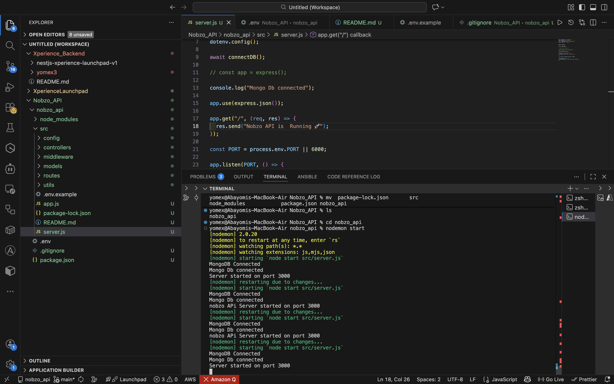

# Blog API — Nobzo Technical Evaluation

## 📌 Project Overview

This project is a simple **Blog REST API** built as part of the Nobzo Backend Developer evaluation.
It demonstrates backend fundamentals including:

* JWT authentication
* Authorization rules
* MongoDB relationships with Mongoose
* Clean RESTful API design
* Filtering, pagination, and search
* Centralized error handling

### 🛠 Tech Stack

* Node.js
* Express.js
* MongoDB
* Mongoose
* JavaScript

---

## 📁 Project Structure

```
nobzo-api/
│
├── src/
│   ├── config/          # DB connection & configuration
│   ├── controllers/     # Route logic
│   ├── middleware/      # Auth, error handling, validation
│   ├── models/          # Mongoose schemas
│   ├── routes/          # Express routes
│   ├── utils/           # Helpers (slug generator, etc.)
│   └── server.js        # App entry point
├── images│
├── .env.example
├── package.json
└── README.md
```

---

## ⚙️ Setup Instructions

### 1️⃣ Clone Repository

```bash
git clone https://github.com/yomex96/nobzo_api.git
cd nobzo-api
```

### 2️⃣ Install Dependencies

```bash
npm install
```

### 3️⃣ Configure Environment Variables

Create a `.env` file in the root directory using the .env.example sample:

```
MONGODB_URI=mongodb://localhost:27017/blog-api
JWT_SECRET=your_super_secret_key
PORT=5000
```

### 4️⃣ Run Server

```bash
npm run dev
```

or

```bash
npm start
```

Server will start at:

```
http://localhost:3000
```



---

## 🔐 Authentication Endpoints

### Register

```bash
curl -X POST http://localhost:3000/api/auth/register \
-H "Content-Type: application/json" \
-d '{
  "name": "John Doe",
  "email": "john@example.com",
  "password": "password123"
}'
```

#### Sample Response

```json
{
  "message": "User registered successfully"
}
```

---

### Login

```bash
curl -X POST http://localhost:3000/api/auth/login \
-H "Content-Type: application/json" \
-d '{
  "email": "john@example.com",
  "password": "password123"
}'
```

#### Sample Response

```json
{
  "token": "JWT_TOKEN_HERE"
}
```

Use this token for protected routes:

```
Authorization: Bearer JWT_TOKEN_HERE
```

---

## 📝 Post Endpoints

### Create Post (Authenticated)

```bash
curl -X POST http://localhost:3000/api/posts \
-H "Authorization: Bearer TOKEN" \
-H "Content-Type: application/json" \
-d '{
  "title": "My First Post",
  "content": "Hello world!",
  "tags": ["intro","welcome"]
}'
```

---

### Get Published Posts (Public)

```bash
curl http://localhost:3000/api/posts?page=1&limit=10
```

Supports filters:

| Query  | Description                 |
| ------ | --------------------------- |
| page   | Pagination page             |
| limit  | Items per page              |
| search | Search title/content        |
| tag    | Filter by tag               |
| author | Filter by author            |
| status | Draft/Published (auth only) |

---

### Get Single Published Post

```bash
curl http://localhost:3000/api/posts/my-first-post
```

---

### Update Post (Author Only)

```bash
curl -X PUT http://localhost:3000/api/posts/:id \
-H "Authorization: Bearer TOKEN" \
-H "Content-Type: application/json" \
-d '{
  "title": "Updated Title",
  "status": "published"
}'
```

---

### Delete Post (Soft Delete)

```bash
curl -X DELETE http://localhost:3000/api/posts/:id \
-H "Authorization: Bearer TOKEN"
```

---

## ✅ Features Implemented

* Password hashing
* JWT authentication
* Author-only permissions
* Slug generation
* Soft delete (`deletedAt`)
* Pagination
* Search & filtering
* Validation
* Centralized error handling

---

## 🌱 Environment Variables

| Variable    | Description               |
| ----------- | ------------------------- |
| MONGODB_URI | MongoDB connection string |
| JWT_SECRET  | Secret for signing tokens |
| PORT        | Server port               |

---

## 🚀 Deployment Notes

Ensure:

* MongoDB is accessible
* Environment variables are configured
* Dependencies installed

Run:

```bash
npm install
npm start
```

---

## 📬 Submission

Repository submitted via:

```
hello@nobzoent.com
```

Includes:

* Source code
* package.json
* .env.example
* README.md

---

## 👤 Author

Your Name: Abayomi Robert Onawole
GitHub: https://github.com/yomex96/nobzo_api.git
